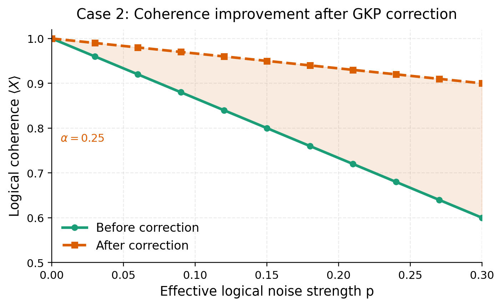
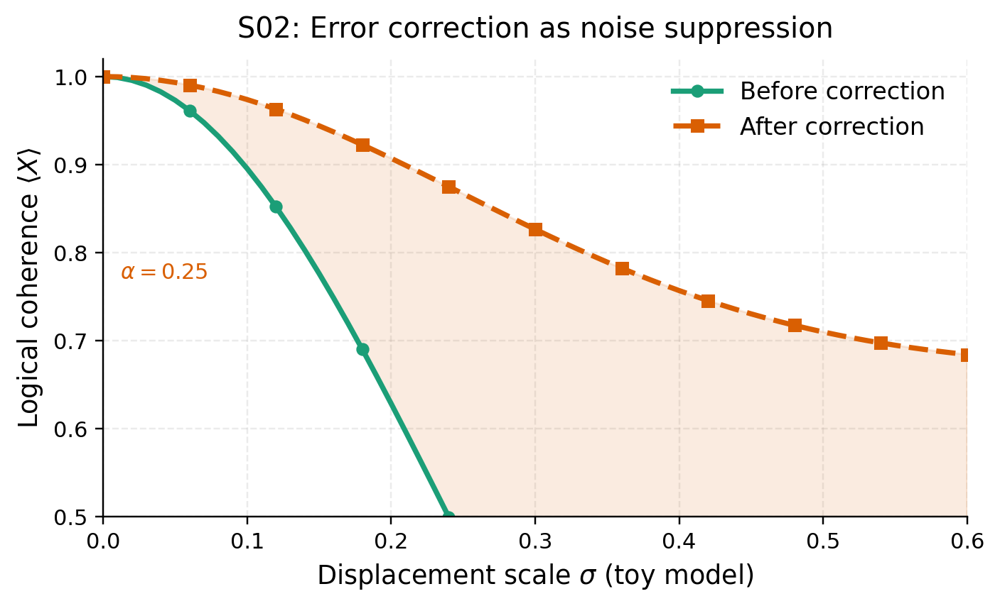
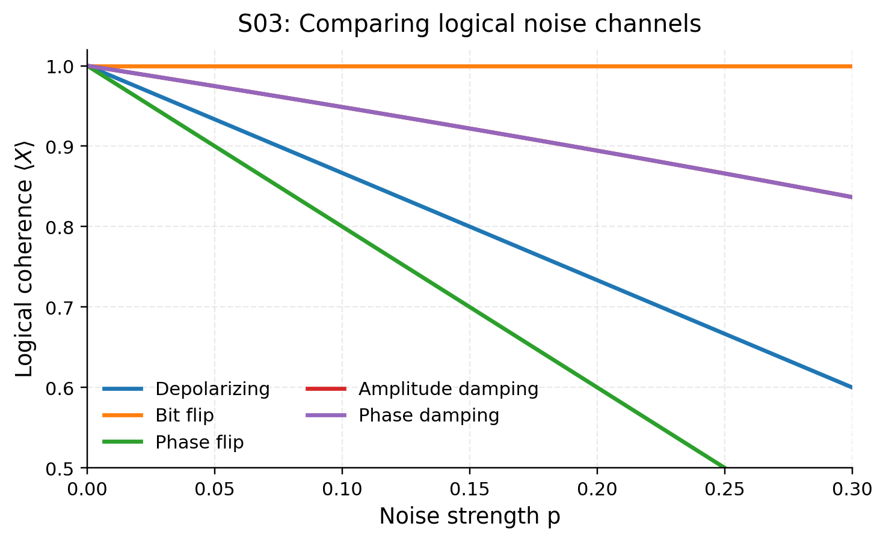
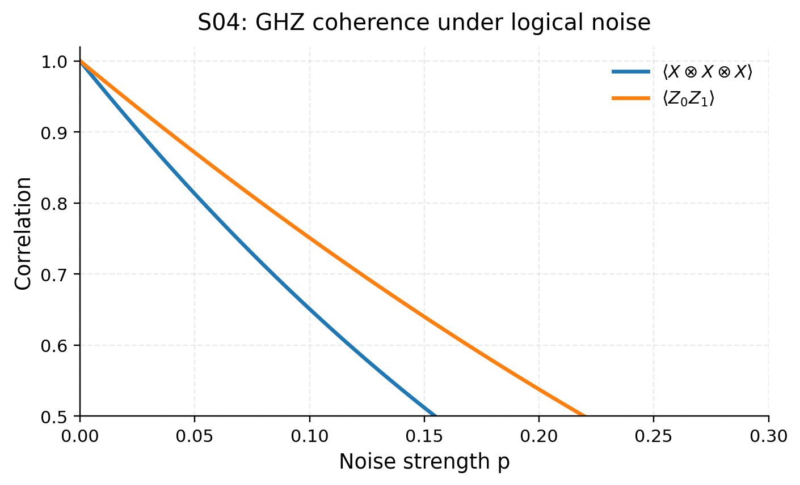
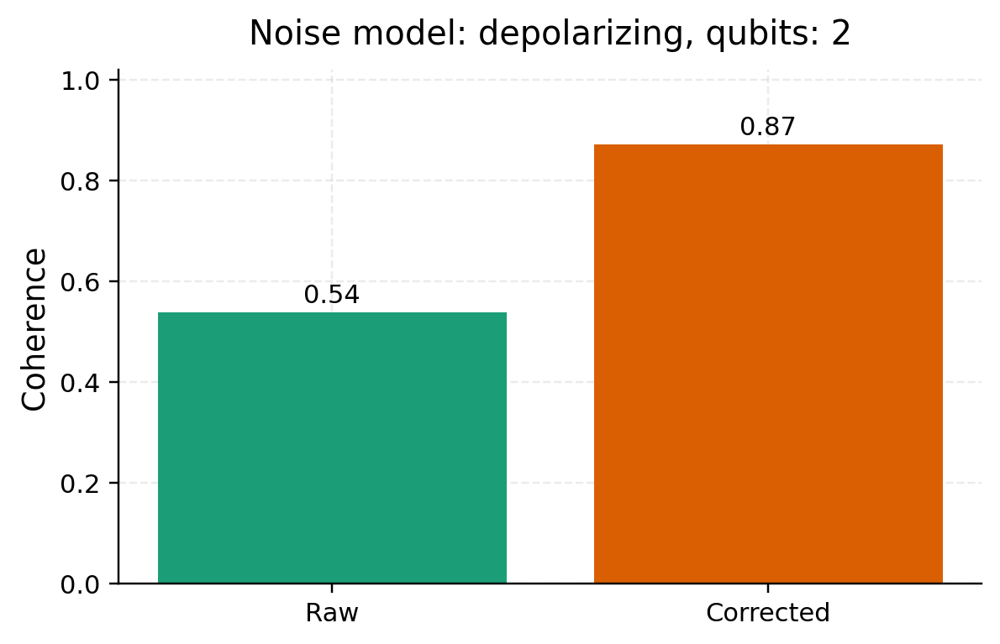

# BosonicFlow-GKP

This repository contains a five-part PennyLane demo series on GKP-based logical quantum error correction in photonic systems.

## Abstract

This five-part demo series introduces GKP-based quantum error correction in photonic systems from a software perspective using PennyLane. Unlike ordinary qubit-level error correction, where syndrome extraction and recovery act directly on qubits, the GKP framing starts from bosonic oscillator noise and studies how correction appears at the logical-circuit layer as reduced effective logical noise. The series progresses from single-qubit logical coherence under effective noise to channel comparisons, multi-qubit Bell/GHZ behavior, and an interactive playground.

## Quickstart

Install project dependencies from the repository root (`notebooks + desktop app`):
- `pennylane` and `numpy` for simulation
- `matplotlib` for plots
- `ipywidgets` for interactive controls in S05
- `PySide6` for the desktop app

```bash
pip install -r requirements.txt
```

## Where this sits in the photonic stack

Photonic quantum computing spans multiple layers, from continuous-variable physics to high-level quantum algorithms. This project intentionally operates between hardware physics and algorithms, at the logical-qubit abstraction layer.

```
Physical photonic hardware
  └── Continuous-variable states
      (squeezing, phase space, homodyne detection)
        └── GKP encoding and correction
            (bosonic, non-Gaussian processes)
              └── Logical qubit with effective noise   <- this repo
                  └── Quantum algorithms
```

## Series roadmap (demos/)

### S01 - Logical noise fundamentals

Equation: $\rho \rightarrow \mathcal{E}(\rho)$ with a depolarizing channel, measured via $\langle X \rangle$.

Notebook: [demos/gkp_qec_demo_01.ipynb](demos/gkp_qec_demo_01.ipynb)



### S02 - Error correction as noise suppression

Equation: $p_{\text{corrected}} = \alpha \, p_{\text{raw}}$, with a toy mapping $p_{\text{raw}}(\sigma) = 1 - \exp(-(\sigma/\sigma_0)^2)$.

Notebook: [demos/gkp_qec_demo_02.ipynb](demos/gkp_qec_demo_02.ipynb)



### S03 - Logical noise model exploration

Equation example: $\mathcal{E}_{\text{bitflip}}(\rho) = (1-p)\,\rho + p\,X\rho X$ alongside other channels.

Notebook: [demos/gkp_qec_demo_03.ipynb](demos/gkp_qec_demo_03.ipynb)



### S04 - Multi-qubit logical systems

Equation focus: Bell and GHZ correlations such as $\langle X \otimes X \rangle$ and $\langle X \otimes X \otimes X \rangle$.

Notebook: [demos/gkp_qec_demo_04.ipynb](demos/gkp_qec_demo_04.ipynb)



### S05 - Interactive logical noise playground

Equation focus: $p_{\text{corrected}} = \alpha \, p_{\text{raw}}$ and the displacement-to-logical mapping above.

Notebook: [demos/gkp_qec_demo_05.ipynb](demos/gkp_qec_demo_05.ipynb)



Note: the notebook uses direct numeric inputs (no sliders). For a live GUI, use the desktop app below.

## Desktop app (offline playground)

The desktop app mirrors S05 with live plots, data export, and multiple noise models.

Build scripts (offline desktop):
- [macOS build script](pyqt_gui/build_macos.sh)
- [Windows build script (PowerShell)](pyqt_gui/build_windows.ps1)
- [Linux build script](pyqt_gui/build_linux.sh)

Build instructions: [pyqt_gui/README.md](pyqt_gui/README.md)

CI workflow: [.github/workflows/build-desktop-app.yml](.github/workflows/build-desktop-app.yml)

## Implementation notes

- Simulations use PennyLane `default.mixed` devices for noisy evolution.
- Noise channels are inserted explicitly in the circuits.
- Each demo is self-contained and follows a continuous narrative.

## What BosonicFlow is

- A conceptual framework for photonic logical noise and correction
- Focused on logical qubits, logical operations, and logical noise models
- Architecture-aware, with a photonic-first interpretation
- Designed to support education, documentation, and onboarding
- Structured as a progressive demo series (S01 to S05)

## What BosonicFlow is not

- Not a new quantum software framework
- Not a continuous-variable (CV) gate tutorial
- Not a replacement for PennyLane or Strawberry Fields
- Not a fault-tolerance benchmark or hardware performance study
- Not a physical simulation of GKP state preparation or decoding
